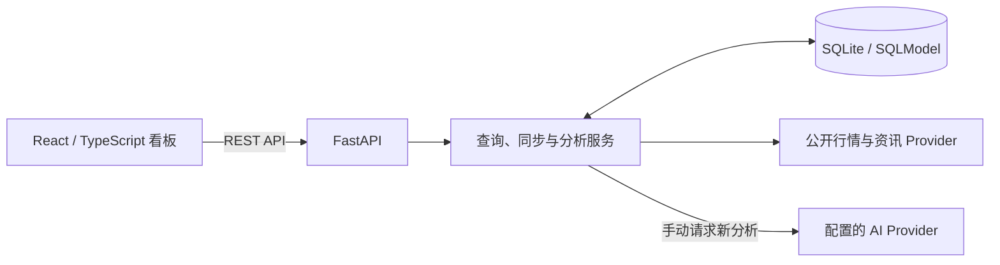

# Investment Board

[](https://github.com/BirdieMoon-peter/Investment-Board/actions/workflows/ci.yml)

**把市场概览、自选行情、个股研究与持仓记录，放在同一张本地看板里。**

*A local investment dashboard for market context, watchlists, and AI-assisted research.*

Investment Board 面向个人的沪深证券与基金跟踪场景。用一页首页观察市场和自选变化，再进入标的详情查看 K 线、基本面、公告与新闻；需要进一步梳理时，可以结合持仓信息手动生成 AI 分析，并保留结果供后续回看。

[功能](#功能) · [快速开始](#快速开始) · [AI 配置](#ai-配置) · [开发与验证](#开发与验证)

## 界面预览


*首页总览：市场概览、焦点标的与大盘指数，提供证券搜索入口。页面下方还包括宏观信息和自选列表。*


*个股研究：日 K 线、成交量与历史价格表。详情页还提供基本面、资讯、持仓和分析记录。*

截图来自独立演示数据库中的实际运行界面。图中行情和日期是演示环境在截图时展示的快照，不代表持续实时更新，也不包含个人真实持仓。

## 功能

| 场景 | 已实现能力 |
| --- | --- |
| 市场概览 | 大盘指数、宏观指标、焦点标的、自选行情与已有 AI 建议标签 |
| 自选管理 | 按证券代码或名称搜索、添加与移除自选；支持手动补充沪深证券及基金代码 |
| 行情同步 | 手动同步全看板或单个标的；可配置自动刷新、自动同步及其间隔 |
| 标的研究 | 报价、历史日 K 线、成交量、分页价格明细、历史报价上下文、财务指标、公司资料、公告与新闻 |
| 基金展示 | 保留报价中的小数精度，避免把低价基金统一四舍五入到两位小数 |
| 持仓记录 | 保存、更新、删除持仓数量、成本、投资期限与备注 |
| AI 辅助研究 | 手动生成股票或持仓分析，读取已有缓存，回看最近分析记录；默认保留最近 20 条 |
| AI 配置 | 在网页设置中修改服务地址、模型、密钥和高级参数，测试连接并随时恢复环境配置 |
| 个性化 | 中英文切换、实时/专注模式、紧凑/舒适密度、首页区域开关；设置保存在当前浏览器 |

首页自动刷新与行情同步只读取已有 AI 标签，不会自动发起新的模型生成。股票与持仓分析由详情页的生成操作触发。

## 技术结构

| 层 | 技术与职责 |
| --- | --- |
| 前端 | React 19、TypeScript、Vite 7；Lightweight Charts 绘制 K 线与成交量 |
| 后端 | FastAPI 提供接口，服务层负责行情同步、信息聚合与分析流程 |
| 存储 | SQLModel + SQLite，保存自选、行情、持仓与 AI 分析记录 |
| 外部数据 | 通过独立 Provider 接入公开行情、宏观、公司资料与资讯来源 |
| 模型接入 | 支持 Anthropic-compatible、OpenAI-compatible，以及 DashScope/Kimi 配置 |
| 验证 | pytest、Vitest、Testing Library，以及隔离数据库的启动与冒烟检查 |



自选、持仓与分析记录保存在本地 SQLite；界面偏好与短期自选缓存保存在浏览器。新分析会将相关标的和持仓上下文发送到你配置的模型服务。

## 快速开始

需要 **Python 3.12+、Node.js 22.12+、npm 和 Bash**。以下命令在 macOS / Linux 的终端中执行。

### 1. 下载并安装依赖

```bash
git clone https://github.com/BirdieMoon-peter/Investment-Board.git
cd Investment-Board

python3.12 -m venv backend/.venv
backend/.venv/bin/python -m pip install -e './backend[dev]'
npm ci --prefix frontend
```

如果使用更高版本的 Python，将 `python3.12` 替换为对应命令即可。

### 2. 启动看板

```bash
./scripts/run_all.sh
```

启动后打开 [本地看板](http://127.0.0.1:5173)，后端接口说明位于 [Swagger UI](http://127.0.0.1:8000/docs)。首次启动会创建项目根目录下的 `investment_board.db`，可从空自选列表开始添加标的。浏览行情、自选和持仓功能无需配置 AI 密钥。

按 `Ctrl+C` 结束本次启动的前后端服务。默认使用 `8000` 和 `5173` 端口，端口占用时启动会失败。也可以分别使用 `./scripts/run_backend.sh` 和 `./scripts/run_frontend.sh`。

### 3. 可选：使用独立演示数据

在首次体验时，可用一个新的临时数据库启动演示，包含 3 个示例证券、历史报价快照和 2 个默认自选：

```bash
DEMO_DIR="$(mktemp -d)"
DATABASE_URL="sqlite:///$DEMO_DIR/investment-board-demo.db" ./scripts/run_all.sh --seed
```

演示报价是固定样例，完整的 K 线、基本面与资讯需要通过在线同步获取。请只对空白或专门的演示数据库使用 `--seed`。已有看板运行时，先停止它再使用默认端口启动演示。

日常运行可通过进程环境变量 `DATABASE_URL` 指定其他数据库路径。脚本会将该值传给后端和演示初始化过程。

## AI 配置

AI 是可选能力，需要一个已认证、模型可用的服务账号。启动后打开首页的 **设置 → AI 服务配置**：

1. 选择服务类型，填写 API 地址、模型名称和密钥。
2. 可按需展开高级设置，修改温度、最大输出长度和请求超时。
3. 点击 **测试连接** 检查当前表单，或直接 **保存 AI 配置**。保存不调用模型，下一次新分析立即使用新配置，无需重启。

支持 OpenAI-compatible、Anthropic-compatible、DashScope/Kimi。API 地址可填写服务根地址、以 `/v1` 结尾的基础地址，或完整的 `/v1/chat/completions`、`/v1/messages` 接口。远程服务使用 HTTPS，本机代理可使用 loopback HTTP。

[查看 AI 配置界面](docs/images/ai-settings.png) · [功能验收记录](docs/verification/web-ai-settings.md)

**测试连接** 只发送一条固定的简短测试文本，不发送自选、持仓或分析记录，也不会保存尚未提交的表单。连接成功说明该服务能响应测试请求；完整投资分析仍需服务支持相应模型、输出格式及额度。

网页不会回显已保存的密钥。地址和服务类型不变时，可保留旧密钥；切换服务地址或协议时，需要输入新密钥，或明确清除密钥后保存。**恢复环境配置** 只移除网页覆盖值，不修改原配置文件。

配置优先级为：**网页保存值 → 进程环境变量 → `backend/.env.local` → 内置默认值**。网页保存值位于后端本机的 `backend/.ai-settings.json`，采用仅文件所有者可读写的权限；这是本地文件存储，不是加密凭据库。该文件已排除版本跟踪，密钥不会存入浏览器 localStorage。`INVESTMENT_BOARD_AI_SETTINGS_FILE` 可指定独立文件路径。

设置面向本机单用户运行，同一后端实例的标签页共享 AI 配置；配置接口仅接受受保护的本机请求。使用其他本机前端端口时，通过 `INVESTMENT_BOARD_AI_SETTINGS_ORIGINS` 显式配置允许的完整来源地址，多个地址以逗号分隔。设置文件路径和允许来源这两项均通过启动进程的环境变量指定。

也可以继续使用环境配置作为备用。先复制模板：

```bash
cp -n backend/.env.example backend/.env.local
```

编辑 `backend/.env.local`，填写所选服务的地址、模型标识和密钥。例如，使用 OpenAI-compatible 接口时：

```dotenv
AI_PROVIDER=openai_compatible
AI_API_URL=https://your-provider.example
AI_MODEL=your-model-id
AI_API_KEY=replace-with-your-own-key
```

以上均为占位值。Anthropic-compatible、DashScope/Kimi 选项见 [配置模板](backend/.env.example)。要让环境配置生效，先在网页中恢复环境配置；修改启动进程的环境变量后需重启后端。

密钥不要提交到版本库。已有缓存可以直接回看；生成新分析还需要外部服务认证、权限和额度正常。应用启动、自动化测试或缓存展示成功，都不代表当前真实模型生成已通过验证。

## 开发与验证

在项目根目录执行：

```bash
# 后端接口、服务与数据层
PYTHONPATH=backend backend/.venv/bin/python -m pytest backend/tests -q

# 前端交互与生产构建
npm test --prefix frontend -- --run
npm run build --prefix frontend

# 启动脚本与隔离冒烟检查
PYTHONPATH=backend backend/.venv/bin/python -m pytest scripts/tests -q
./scripts/smoke_watchlist.sh
```

冒烟检查使用独立临时数据库、日志和随机本地端口，结束时清理本次创建的资源，可以与主服务并行运行。启动等待默认 120 秒；首次依赖加载较慢时，可使用 `SMOKE_STARTUP_TIMEOUT=180 ./scripts/smoke_watchlist.sh` 调整。自动化测试中的模拟 AI 回复用于验证应用流程。

更多开发约定与验证步骤见 [贡献指南](CONTRIBUTING.md)。

### 主要接口

| 功能 | 接口 |
| --- | --- |
| 市场概览 | `GET /api/homepage/overview` |
| 搜索证券 | `GET /api/watchlist/securities/search?query=...` |
| 自选列表与添加 | `GET /api/watchlist/items`、`POST /api/watchlist/items` |
| 自选同步 | `POST /api/watchlist/sync` |
| 标的详情与同步 | `GET /api/stocks/{security_id}`、`POST /api/stocks/{security_id}/sync` |
| 持仓 | `GET /api/holdings`、`POST /api/holdings`、`PUT /api/holdings/{holding_id}`、`DELETE /api/holdings/{holding_id}` |
| 股票与持仓分析 | `POST /api/ai/stocks/{security_id}/advice`、`POST /api/ai/holdings/{holding_id}/advice` |
| 分析历史 | `GET /api/ai/history` |
| AI 配置 | `GET /api/ai/settings`、`PUT /api/ai/settings`、`DELETE /api/ai/settings` |
| AI 连接测试 | `POST /api/ai/settings/test` |

完整请求字段、响应与其他接口以运行后的 [API 文档](http://127.0.0.1:8000/docs) 为准。

### 目录

```text
Investment-Board/
├── frontend/          # 看板、详情页、界面组件与前端测试
├── backend/
│   ├── app/
│   │   ├── api/       # FastAPI 路由
│   │   ├── services/  # 同步、分析与外部数据 Provider
│   │   ├── db/        # 数据模型、仓储与初始化
│   │   └── schemas/   # 接口数据结构
│   └── tests/         # 后端测试
├── scripts/           # 本地启动、冒烟检查与脚本测试
├── docs/              # 工作流、模块说明与界面截图
└── memory/            # 项目决策与执行状态
```

项目范围与模块边界见 [工作流](docs/00-workflow.md)、[路线图](docs/01-roadmap.md) 和 [模块清单](docs/02-module-registry.md)。

## 数据与使用边界

- 公开来源可能延迟、缺失或不可用。部分来源失败时，界面会显示提示，部分数据可能保留旧值；以各项数据日期为准。
- 无可靠来源时间时不编造“最新”时间。浏览器自选缓存最长保留 30 分钟，缓存日期和在线数据日期可能不同。
- 当前面向个人本地使用，不包含交易执行、多用户账户、组合优化或生产环境部署方案。
- AI 内容用于辅助研究，不构成投资建议，也不会自动下单。任何实际交易决策都需要独立核实数据与风险。
