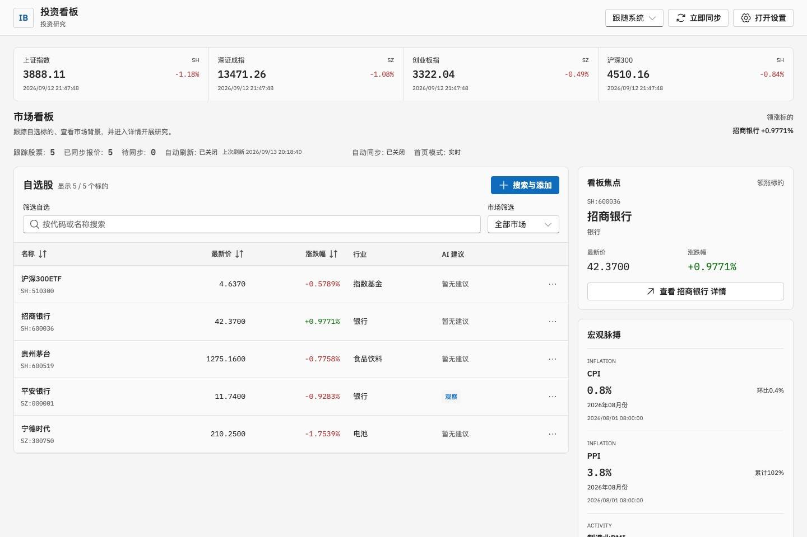
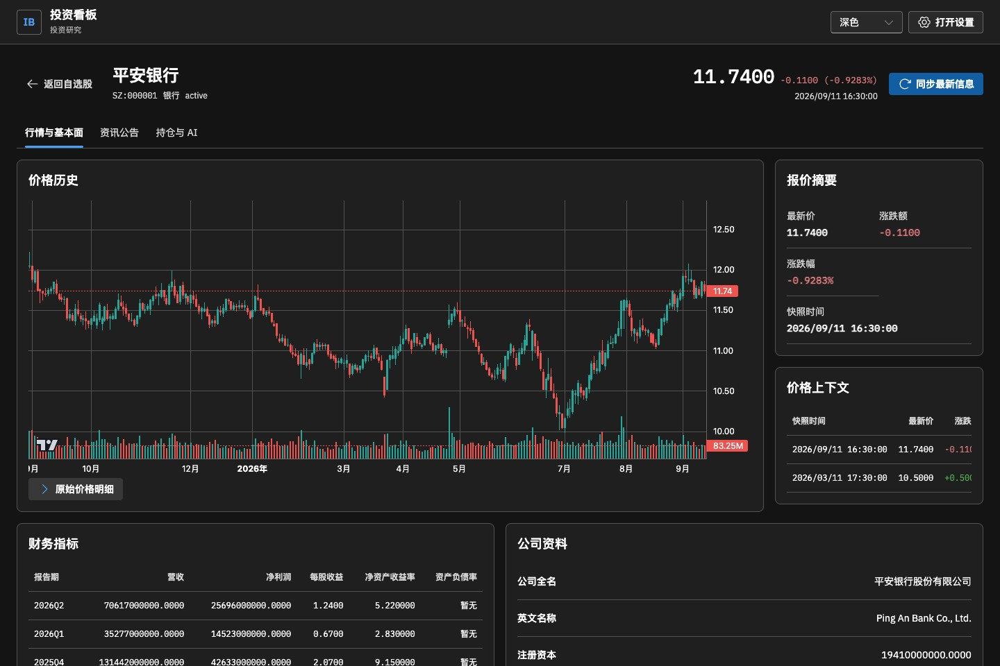
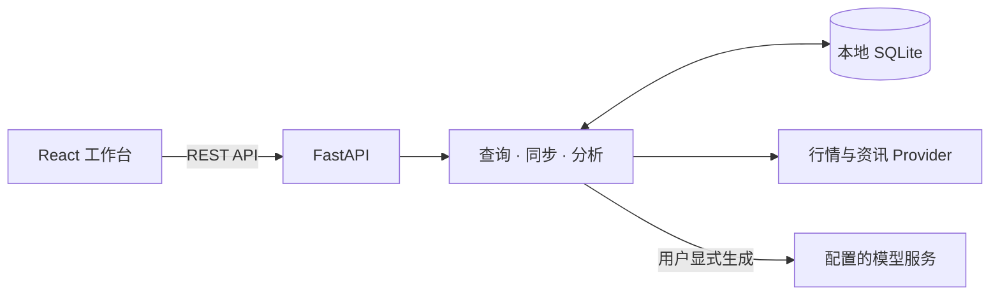

<div align="center">

# Investment Board

**把自选行情、个股研究与 AI 分析，放在同一张工作台。**

A local-first workspace for market tracking and AI-assisted investment research.

[](https://github.com/BirdieMoon-peter/Investment-Board/actions/workflows/ci.yml)


[界面预览](#界面预览) · [核心体验](#核心体验) · [快速开始](#快速开始) · [AI 配置](#ai-配置) · [开发与验证](#开发与验证)

</div>

Investment Board 是面向个人的沪深证券与基金研究工作台。它将自选管理、市场背景、历史 K 线、公司信息、持仓记录和按需 AI 分析连接起来，方便从日常观察进入具体标的研究。

**自选是首页的中心，研究按任务分组，模型服务在网页中配置。** 数据保存在本地 SQLite；界面提供中英文、浅色、深色与跟随系统主题。

## 界面预览

### 自选工作台 · 先看到值得关注的变化



在同一屏中查看关注标的、比较价格与涨跌幅，并通过本地关键词和沪深市场筛选缩小范围。大盘指数、焦点标的和宏观摘要提供辅助背景；搜索添加与列表筛选分开，操作目的更清楚。

### 个股研究 · 沿着研究任务深入



详情分为 **行情与基本面 / 资讯公告 / 持仓与 AI**。图表跟随主题，原始价格明细按需展开；切换分组时保留持仓草稿和已选分析，返回首页时保留筛选、排序与位置。

> 截图为独立演示数据库的真实运行画面，包含公开历史快照和固定测试行情。部分 AI 标签来自本地模拟回复，不代表实时行情、实际投资表现或真实模型建议；不包含个人真实持仓。[截图来源说明](docs/images/README.md)

## 核心体验

| 从观察到研究 | 你可以做什么 |
| --- | --- |
| **管理自选** | 搜索并添加证券或基金，手动补充代码；按名称、最新价或涨跌幅排序，结合关键词与市场筛选；移除前确认具体标的 |
| **掌握背景** | 查看大盘指数、宏观指标和焦点标的；手动同步全看板或单个标的，按需配置自动刷新与同步 |
| **研究标的** | 阅读历史日 K 线、成交量、报价快照、财务指标与公司资料；查看带来源、日期和原链接的公告与新闻 |
| **记录持仓** | 保存、修改或删除数量、成本、投资期限与备注，为持仓视角分析提供上下文 |
| **调用 AI** | 显式生成股票或持仓分析，阅读结构化要点与长篇分析；直接回看缓存和最近历史，默认展示最近 20 条 |
| **配置工作台** | 在网页中修改模型服务与密钥、测试连接、恢复环境配置；调整语言、主题、密度和首页区域 |

- **保留数据精度**：沿用报价的小数精度，适合展示低价基金；缺失数据明确标记，不补造数值。
- **减少重复操作**：研究分组保留草稿，返回自选恢复上下文；AI 配置草稿切换标签不会丢失，关闭前提示未保存修改。
- **适应不同屏幕**：桌面以表格和分栏组织信息，移动端以单列和研究分组选择器组织内容；宽数据表在自身区域内滚动。
- **按需使用 AI**：首页刷新和行情同步只读取已有分析标签，不会自动发起新的模型生成。

## 快速开始

**环境要求：Python 3.12+、Node.js 22.12+、npm、Bash。** 以下步骤适用于 macOS / Linux。

### 1. 安装

```bash
git clone https://github.com/BirdieMoon-peter/Investment-Board.git
cd Investment-Board

python3.12 -m venv backend/.venv
backend/.venv/bin/python -m pip install -e './backend[dev]'
npm ci --prefix frontend
```

使用其他兼容 Python 版本时，将 `python3.12` 替换为对应命令。

### 2. 启动

```bash
./scripts/run_all.sh
```

打开 **[本地工作台](http://127.0.0.1:5173)**，从空自选列表开始添加标的。后端 [交互式 API 文档](http://127.0.0.1:8000/docs) 同时可用。

首次启动会创建项目根目录中的 `investment_board.db`。浏览行情、自选与持仓功能无需 AI 密钥；配置模型后即可按需生成分析。`Ctrl+C` 结束本次启动的前后端服务。

### 3. 配置 AI（可选）

进入 **设置 → AI 服务配置**，填写自己的服务地址、模型与密钥，然后测试连接并保存。下一次新分析使用新配置，无需重启。详细字段见下节。

<details>
<summary><strong>可选：使用独立演示数据</strong></summary>

使用一个新的临时数据库，载入 3 个示例证券、历史报价快照和 2 个默认自选：

```bash
DEMO_DIR="$(mktemp -d)"
DATABASE_URL="sqlite:///$DEMO_DIR/investment-board-demo.db" ./scripts/run_all.sh --seed
```

演示报价是固定样例，完整 K 线、基本面与资讯需要通过在线同步获取。只对空白或专门的演示数据库使用 `--seed`。已有看板运行时，先停止它再使用默认端口启动演示。

</details>

<details>
<summary><strong>端口、数据库与分别启动</strong></summary>

- 默认端口为后端 `8000`、前端 `5173`；端口占用时启动会失败。
- 可分别使用 `./scripts/run_backend.sh` 与 `./scripts/run_frontend.sh`。
- 通过进程环境变量 `DATABASE_URL` 指定其他数据库路径，启动和演示初始化脚本会使用该值。

</details>

## AI 配置

### 在网页中连接 DeepSeek 官方 Flash

以下为一个可用的起步配置。模型标识以 [DeepSeek 官方文档](https://api-docs.deepseek.com/zh-cn/) 为准。

| 网页字段 | 填写内容 |
| --- | --- |
| 服务商 / 协议 | `OpenAI-compatible` |
| 服务地址 | `https://api.deepseek.com` |
| 模型名称 | `deepseek-flash` |
| 新 API 密钥 | 自己账号的 API key |
| 高级设置 · 最大输出长度 | `4096`，为结构化要点和长篇分析留出空间 |

1. 在 **设置 → AI 服务配置** 中填写上述字段。首次设置或替换密钥时，选择替换密钥并输入新值。
2. 点击 **测试连接** 验证当前草稿。它只发送一条固定的简短文本，不发送自选、持仓或历史记录，也不会保存草稿。
3. 点击 **保存 AI 配置**。保存不调用模型；在个股详情的 **持仓与 AI** 中，选择股票或持仓作用域，再显式生成新分析。

[查看 AI 配置界面](docs/images/ai-settings.png) · [AI 配置验收记录](docs/verification/web-ai-settings.md)

同时支持其他 OpenAI-compatible、Anthropic-compatible 及 DashScope/Kimi 配置。地址可填写服务根地址、以 `/v1` 结尾的基础地址，或完整的 `/v1/chat/completions`、`/v1/messages` 接口。远程服务使用 HTTPS，本机代理可使用 loopback HTTP。

### 配置怎样保存

**网页保存值 → 进程环境变量 → `backend/.env.local` → 内置默认值。**

- 网页不会回显已保存的密钥。地址与协议不变时，可保留当前密钥；更换地址或协议时，需要输入新密钥，或明确清除后保存。
- 网页覆盖值保存在后端本机的 `backend/.ai-settings.json`，文件权限仅允许所有者读写。它是本地文件存储，不是加密凭据库；已排除 Git 跟踪，密钥不会写入浏览器 localStorage。
- **恢复环境配置** 只移除网页覆盖值，不修改环境配置文件。保存、测试或恢复期间，抽屉会保持打开，防止重复操作。
- 新分析会将相关标的及适用的持仓上下文发送到所选模型服务。连接测试成功仅表示服务能响应测试文本，完整分析仍依赖模型、输出格式、权限与额度。

<details>
<summary><strong>环境文件与其他本地运行配置</strong></summary>

复制模板，填写自己的配置作为备用：

```bash
cp -n backend/.env.example backend/.env.local
```

```dotenv
AI_PROVIDER=openai_compatible
AI_API_URL=https://api.deepseek.com
AI_MODEL=deepseek-flash
AI_API_KEY=replace-with-your-own-key
AI_MAX_OUTPUT_TOKENS=4096
```

示例密钥是占位值。完整字段见 [环境配置模板](backend/.env.example)。要使用环境配置，先在网页中恢复环境配置；修改启动进程的环境变量后需要重启后端。

设置面向本机单用户运行，同一后端实例的标签页共享 AI 配置。配置接口只接受受保护的本机请求。以下两项通过启动进程的环境变量指定：

- `INVESTMENT_BOARD_AI_SETTINGS_FILE`：独立网页配置文件路径。
- `INVESTMENT_BOARD_AI_SETTINGS_ORIGINS`：允许访问配置接口的完整本机前端来源地址，多个值以逗号分隔。使用其他本机前端端口时需显式配置。

</details>

## 技术结构



| 层 | 实现 |
| --- | --- |
| 界面与交互 | React 19、TypeScript、Vite 7、Fluent UI 9、TanStack Table 8 |
| 图表与字体 | Lightweight Charts；自托管 IBM Plex Sans / Mono |
| 接口与服务 | FastAPI；独立 Provider 负责外部行情、信息与模型接入 |
| 持久化 | SQLModel + SQLite，保存自选、行情、持仓和 AI 分析记录 |
| 验证与维护 | pytest、Vitest、Testing Library；隔离启动/冒烟检查与 GitHub Actions |

自选、持仓和分析记录保存在本地；界面偏好与最长 30 分钟的自选缓存保存在当前浏览器。详情和设置代码按需加载，图表切换主题时保留当前时间范围。

## 开发与验证

在项目根目录执行：

```bash
# 后端接口、服务与数据层
PYTHONPATH=backend backend/.venv/bin/python -m pytest backend/tests -q

# 前端交互与生产构建
npm test --prefix frontend -- --run
npm run build --prefix frontend

# 启动脚本与隔离冒烟检查
PYTHONPATH=backend backend/.venv/bin/python -m pytest scripts/tests -q
./scripts/smoke_watchlist.sh
```

冒烟检查使用独立临时数据库、日志和随机本地端口，结束时清理本次资源，可以与主服务并行运行。启动等待默认 120 秒；首次依赖加载较慢时可设置 `SMOKE_STARTUP_TIMEOUT=180`。

[贡献指南](CONTRIBUTING.md) · [工作台验收记录](docs/verification/professional-workspace-redesign.md) · [模块与进度](docs/02-module-registry.md)

<details>
<summary><strong>主要接口与源码目录</strong></summary>

| 功能 | 接口 |
| --- | --- |
| 市场概览 | `GET /api/homepage/overview` |
| 证券搜索 | `GET /api/watchlist/securities/search?query=...` |
| 自选管理与同步 | `/api/watchlist/items`、`POST /api/watchlist/sync` |
| 标的详情与同步 | `GET /api/stocks/{security_id}`、`POST /api/stocks/{security_id}/sync` |
| 持仓记录 | `/api/holdings`、`/api/holdings/{holding_id}` |
| 股票 / 持仓分析 | `POST /api/ai/stocks/{security_id}/advice`、`POST /api/ai/holdings/{holding_id}/advice` |
| 分析历史 | `GET /api/ai/history` |
| AI 配置与测试 | `/api/ai/settings`、`POST /api/ai/settings/test` |

完整请求方法、字段和响应以运行后的 [API 文档](http://127.0.0.1:8000/docs) 为准。

```text
Investment-Board/
├── frontend/          # 工作台、详情、界面组件和前端测试
├── backend/
│   ├── app/
│   │   ├── api/       # 接口路由
│   │   ├── services/  # 同步、分析和外部 Provider
│   │   ├── db/        # 模型、仓储和初始化
│   │   └── schemas/   # 请求与响应结构
│   └── tests/         # 后端测试
├── scripts/           # 启动与隔离冒烟检查
├── docs/              # 设计、模块、验收和截图
└── memory/            # 项目决策与执行状态
```

</details>

## 数据与使用边界

- 公开数据源可能延迟、缺失或暂时不可用。以各项来源日期为准；部分同步失败时，界面会提示并可能保留旧值。
- 自动化测试和演示中的模拟 AI 回复用于验证应用流程；缓存展示成功不代表当前外部模型可用。
- 当前面向个人本地研究，不包含交易执行、多用户账户、组合优化或生产部署方案。
- AI 内容用于辅助研究，不构成投资建议，也不会自动下单。
