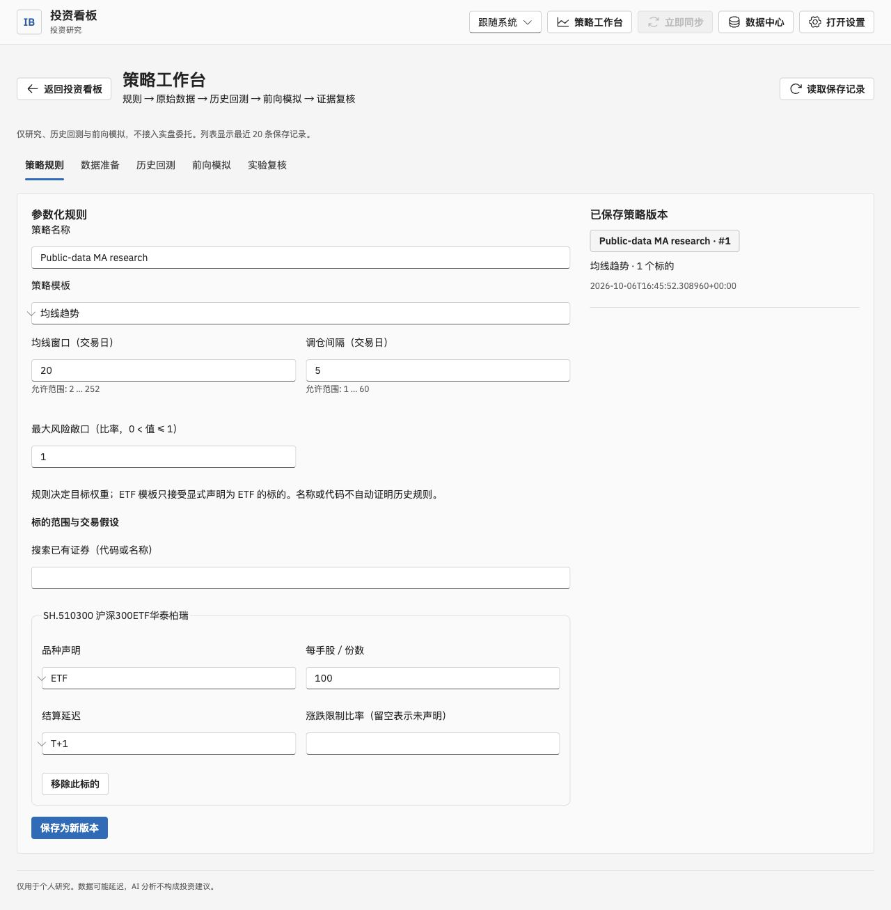
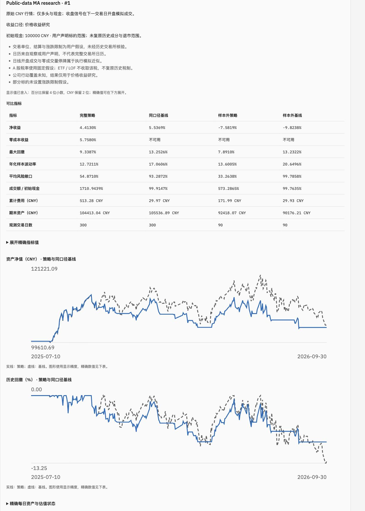
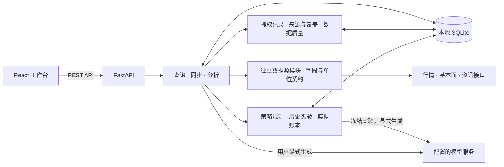

<div align="center">

# Investment Board

**面向沪深 A 股与场内 ETF／LOF 的本地投资研究工作台**

A local-first workspace for market research, strategy experiments and evidence-based analysis.

[](https://github.com/BirdieMoon-peter/Investment-Board/actions/workflows/ci.yml)


[界面预览](#界面预览) · [功能模块](#功能模块) · [数据来源与口径](#数据来源与口径) · [策略研究](#策略研究流程) · [快速开始](#快速开始) · [AI 配置](#ai-配置) · [开发与验证](#开发与验证)

</div>

## 项目概述

Investment Board 是一个面向个人本地部署的投资研究应用，覆盖沪深 A 股与场内 ETF／LOF 的自选跟踪、行情浏览、基本面研究、资讯查阅、持仓记录、量化策略研究与证据驱动的 AI 分析。项目将数据获取、指标解释、历史实验和模拟跟踪整合到统一工作台，支持从市场观察到策略复盘的连续研究流程。

系统采用 React 与 FastAPI 前后端分离架构，以 SQLite 保存业务数据。前端围绕自选列表和研究任务组织信息，提供中英文界面、浅色与深色主题及响应式布局；模型服务可通过网页配置，并由用户显式触发分析。

## 界面预览

以下截图摄于 2026-10-07，展示策略工作区的真实运行界面。演示使用独立数据库与公开 ETF 原始日线，不包含个人持仓。

### 策略规则与交易假设



工作区将规则、数据、回测、模拟与复核分为连续的研究任务。策略参数与标的交易假设分别填写，保存后形成新版本；切换工作区保留自选筛选、持仓表单和研究草稿。

### 回测比较与风险观察



历史实验同时展示策略与基准、完整区间与样本外区间的结果，以及费用、敞口、净值和回撤。日常指标采用易读的显示精度，精确数值、信号计算依据与成交记录可以展开核对。

> 截图中的历史实验仅演示功能，使用用户声明的交易假设，公司行动覆盖未知；不能据此认定策略有效或已核验含分红总收益。[截图与数据说明](docs/screenshots/README.md)。既有自选与个股界面可查看 [市场看板](docs/images/dashboard.jpg) 和 [个股研究](docs/images/stock-detail.jpg)，截图摄于 2026-09-13，[来源说明](docs/images/README.md)。

## 功能模块

| 模块 | 功能说明 |
| --- | --- |
| **自选管理** | 搜索并添加证券或基金，手动补充代码；按名称、最新价或涨跌幅排序，结合关键词与市场筛选；移除前确认具体标的 |
| **市场概览** | 查看大盘指数、宏观指标和焦点标的；手动同步全看板或单个标的，按需配置自动刷新与同步 |
| **标的研究** | 阅读历史日 K 线、成交量、报价快照、财务指标与公司资料；查看带来源、日期和原链接的公告与新闻 |
| **数据中心** | 按来源查看接口能力、原始格式、字段单位及转换规则；控制受管数据源，查看标的数据质量并按类别重试；维护分类与比较基准，查阅基金资料和净值 |
| **可复核指标** | 查看价格收益、窗口回撤、波动率、均线与量能，以及财务同比和当前持仓估值；每项结果附带公式、输入口径和缺口说明 |
| **证据研究** | 保存研究问题与假设，显式生成包含支持证据、反证及数据缺口的报告；保留输入快照和版本，按本地数据变化复查观点并确认事件 |
| **策略工作区** | 用 ETF 动量轮动、均线趋势和 ETF 均值回归模板保存规则与参数；冻结数据运行历史实验，比较基准与样本外结果，独立记录模拟账户及成交依据 |
| **持仓记录** | 保存、修改或删除数量、成本、投资期限与备注，为持仓视角分析提供上下文 |
| **AI 辅助分析** | 显式生成股票或持仓分析，阅读结构化要点与长篇分析；直接回看缓存和最近历史，默认展示最近 20 条 |
| **工作台配置** | 在网页中修改模型服务与密钥、测试连接、恢复环境配置；调整语言、主题、密度和首页区域 |

- **数据展示**：沿用报价的小数精度，适合展示低价基金；缺失数据明确标记，不补造数值。
- **状态保留**：研究分组保留草稿，返回自选恢复上下文；AI 配置草稿切换标签不会丢失，关闭前提示未保存修改。
- **响应式交互**：桌面以表格和分栏组织信息，移动端以单列和研究分组选择器组织内容；宽数据表在自身区域内滚动。
- **分析触发机制**：首页刷新和行情同步只读取已有分析标签，不会自动发起新的模型生成。

## 数据来源与口径

数据接入按来源独立组织。每个来源模块声明其接口格式、原始字段类型与单位、标准化换算、日期精度、价格复权口径和缺失值规则，再由同步服务写入本地数据集。字段契约、实际抓取结果与已保存数据的质量分别记录，避免将接口注册或一次请求成功当作数据完整性的证明。

| 来源 | 当前接入范围 |
| --- | --- |
| 东方财富 | 证券行情、公告、资讯、财务与公司资料；按标的类型接入 ETF／LOF 资料和单位／累计净值 |
| 新浪 | 证券公告、资讯、历史行情与报价；首页指数 |
| 网易 | 历史行情备用来源；部分单位与复权口径仍待核实 |
| 腾讯 | 首页指数，不参与当前受管标的同步 |
| 凤凰财经 | 已有资讯解析器，尚未接入默认同步流程 |

网页的 **数据中心** 提供独立来源视图，按需展开接口与字段详情；标的数据视图区分观察日期、获取时间、覆盖范围和质量状态，并支持选择类别及价格来源后更新。查看已保存数据不会触发外部采集或模型生成。

来源管理接口支持查询各来源的字段契约与实际抓取记录，以及启停已接入的标的数据源。标的数据接口支持按类别同步、查询覆盖与质量状态，并维护手动分类及带市场前缀的比较基准映射。控制范围明确限定为受管标的同步；首页、证券检索与尚未接入的能力单独标注。失败或空响应保留已有数据和上一次成功获取时间；未知单位、价格口径与覆盖范围保持未知。

例如，东方财富股票／场内基金日线成交量由「手」换算为「股」；指数价格使用点位，指数成交量与复权口径未经核实则保留未知。报价涨跌幅与财务 ROE 保留百分数值，而基金费率采用小数比例。前复权行情不能直接与原始基金净值计算折溢价，累计净值也不等同于红利再投资收益。完整字段与边界见 [数据源契约文档](docs/data-sources/README.md)。

指标由确定性计算服务生成，AI 不承担金融数值计算。界面可展开查看公式版本、观察窗口、样本数和输入来源；无法满足价格口径、报告期间或基准条件的结果明确显示无法计算。持仓权重只使用已知可估值仓位，缺少有效价格时标记估值不完整，不生成没有交易流水支持的历史组合表现。详见 [指标计算与输入口径](docs/indicators/README.md)。

研究工作区将研究问题、事实、推断与假设分开组织，保存报告生成时的数据、指标和证据。引用存在性、结构化数值核对与可选模型语义复核分别展示；数据变化通过人工触发的本地复查形成事件，不自动改写旧报告或生成新分析。详见 [证据驱动的 AI 研究](docs/research/README.md)。

## 策略研究流程

策略工作区以 **规则 → 数据 → 历史实验 → 模拟跟踪 → 证据复盘** 组织操作。行情快照、策略版本和实验结果分别保存；交易信号使用已经观察到的数据，按后续交易日开盘模拟执行。页面同时展示成本、基准、拒单原因和数据限制，便于检查结果是否依赖某一组参数或过低的成本假设。

实际持仓与模拟账本分开管理。模拟账户从创建时点向后记录，数据修订不会覆盖已有历史；所有采集、回测和 AI 研究均由用户显式触发。当前定位为日频股票与场内基金研究，不包含券商接入或真实自动下单。详见 [策略研究与模拟跟踪](docs/quant/README.md)。

## 快速开始

**环境要求：Python 3.12+、Node.js 22.12+、npm、Bash。** 以下步骤适用于 macOS / Linux。

### 1. 安装

```bash
git clone https://github.com/BirdieMoon-peter/Investment-Board.git
cd Investment-Board

python3.12 -m venv backend/.venv
backend/.venv/bin/python -m pip install -e './backend[dev]'
npm ci --prefix frontend
```

使用其他兼容 Python 版本时，将 `python3.12` 替换为对应命令。

### 2. 启动

```bash
./scripts/run_all.sh
```

打开 **[本地工作台](http://127.0.0.1:5173)**，从空自选列表开始添加标的。后端 [交互式 API 文档](http://127.0.0.1:8000/docs) 同时可用。

首次启动会创建项目根目录中的 `investment_board.db`。浏览行情、自选与持仓功能无需 AI 密钥；配置模型后即可按需生成分析。`Ctrl+C` 结束本次启动的前后端服务。

### 3. 配置 AI（可选）

进入 **设置 → AI 服务配置**，填写自己的服务地址、模型与密钥，然后测试连接并保存。下一次新分析使用新配置，无需重启。详细字段见下节。

<details>
<summary><strong>可选：使用独立演示数据</strong></summary>

使用一个新的临时数据库，载入 3 个示例证券、历史报价快照和 2 个默认自选：

```bash
DEMO_DIR="$(mktemp -d)"
DATABASE_URL="sqlite:///$DEMO_DIR/investment-board-demo.db" ./scripts/run_all.sh --seed
```

演示报价是固定样例，完整 K 线、基本面与资讯需要通过在线同步获取。只对空白或专门的演示数据库使用 `--seed`。已有看板运行时，先停止它再使用默认端口启动演示。

</details>

<details>
<summary><strong>端口、数据库与分别启动</strong></summary>

- 默认端口为后端 `8000`、前端 `5173`；端口占用时启动会失败。
- 可分别使用 `./scripts/run_backend.sh` 与 `./scripts/run_frontend.sh`。
- 通过进程环境变量 `DATABASE_URL` 指定其他数据库路径，启动和演示初始化脚本会使用该值。

</details>

## AI 配置

### DeepSeek 官方 Flash 配置示例

以下示例使用 DeepSeek 官方服务。模型标识以 [DeepSeek 官方文档](https://api-docs.deepseek.com/zh-cn/) 为准。

| 网页字段 | 填写内容 |
| --- | --- |
| 服务商 / 协议 | `OpenAI-compatible` |
| 服务地址 | `https://api.deepseek.com` |
| 模型名称 | `deepseek-flash` |
| 新 API 密钥 | 自己账号的 API key |
| 高级设置 · 最大输出长度 | `4096`，为结构化要点和长篇分析留出空间 |

1. 在 **设置 → AI 服务配置** 中填写上述字段。首次设置或替换密钥时，选择替换密钥并输入新值。
2. 点击 **测试连接** 验证当前草稿。它只发送一条固定的简短文本，不发送自选、持仓或历史记录，也不会保存草稿。
3. 点击 **保存 AI 配置**。保存不调用模型；在个股详情的 **持仓与 AI** 中，选择股票或持仓作用域，再显式生成新分析。

[查看 AI 配置界面](docs/images/ai-settings.png)

同时支持其他 OpenAI-compatible、Anthropic-compatible 及 DashScope/Kimi 配置。地址可填写服务根地址、以 `/v1` 结尾的基础地址，或完整的 `/v1/chat/completions`、`/v1/messages` 接口。远程服务使用 HTTPS，本机代理可使用 loopback HTTP。

### 配置优先级与凭据存储

**网页保存值 → 进程环境变量 → `backend/.env.local` → 内置默认值。**

- 网页不会回显已保存的密钥。地址与协议不变时，可保留当前密钥；更换地址或协议时，需要输入新密钥，或明确清除后保存。
- 网页覆盖值保存在后端本机的 `backend/.ai-settings.json`，文件权限仅允许所有者读写。它是本地文件存储，不是加密凭据库；已排除 Git 跟踪，密钥不会写入浏览器 localStorage。
- **恢复环境配置** 只移除网页覆盖值，不修改环境配置文件。保存、测试或恢复期间，抽屉会保持打开，防止重复操作。
- 新分析会将相关标的及适用的持仓上下文发送到所选模型服务。连接测试成功仅表示服务能响应测试文本，完整分析仍依赖模型、输出格式、权限与额度。

<details>
<summary><strong>环境文件与其他本地运行配置</strong></summary>

复制模板，填写自己的配置作为备用：

```bash
cp -n backend/.env.example backend/.env.local
```

```dotenv
AI_PROVIDER=openai_compatible
AI_API_URL=https://api.deepseek.com
AI_MODEL=deepseek-flash
AI_API_KEY=replace-with-your-own-key
AI_MAX_OUTPUT_TOKENS=4096
```

示例密钥是占位值。完整字段见 [环境配置模板](backend/.env.example)。要使用环境配置，先在网页中恢复环境配置；修改启动进程的环境变量后需要重启后端。

设置面向本机单用户运行，同一后端实例的标签页共享 AI 配置。配置接口只接受受保护的本机请求。以下两项通过启动进程的环境变量指定：

- `INVESTMENT_BOARD_AI_SETTINGS_FILE`：独立网页配置文件路径。
- `INVESTMENT_BOARD_AI_SETTINGS_ORIGINS`：允许访问配置接口的完整本机前端来源地址，多个值以逗号分隔。使用其他本机前端端口时需显式配置。

</details>

## 技术架构


```mermaid
flowchart LR
    UI[React 工作台] -->|REST API| API[FastAPI]
    API --> Services[查询 · 同步 · 分析]
    Services <--> DB[(本地 SQLite)]
    Services --> Sources[独立数据源模块 · 字段与单位契约]
    Sources --> Data[行情 · 基本面 · 资讯接口]
    Services --> Quality[抓取记录 · 来源与覆盖 · 数据质量]
    Quality <--> DB
    Services --> Quant[策略规则 · 历史实验 · 模拟账本]
    Quant <--> DB
    Quant -->|冻结实验，显式生成| AI
    Services -->|用户显式生成| AI[配置的模型服务]
```

| 层 | 实现 |
| --- | --- |
| 界面与交互 | React 19、TypeScript、Vite 7、Fluent UI 9、TanStack Table 8 |
| 图表与字体 | Lightweight Charts；自托管 IBM Plex Sans / Mono |
| 接口与服务 | FastAPI；各来源模块声明数据契约，Provider 负责获取与校验，同步服务记录来源和质量 |
| 持久化 | SQLModel + SQLite，保存自选、行情、持仓、研究问题、不可变策略实验与模拟账本 |
| 验证与维护 | pytest、Vitest、Testing Library；隔离启动/冒烟检查与 GitHub Actions |

自选、持仓和分析记录保存在本地；界面偏好与最长 30 分钟的自选缓存保存在当前浏览器。详情和设置代码按需加载，图表切换主题时保留当前时间范围。

## 开发与验证

在项目根目录执行：

```bash
# 后端接口、服务与数据层
DATABASE_URL=sqlite:// INVESTMENT_BOARD_ENV_FILE=/dev/null PYTHONPATH=backend \
  backend/.venv/bin/python -m pytest backend/tests -q

# 前端交互与生产构建
npm test --prefix frontend -- --run
npm run build --prefix frontend

# 启动脚本与隔离冒烟检查
PYTHONPATH=backend backend/.venv/bin/python -m pytest scripts/tests -q
./scripts/smoke_watchlist.sh
```

冒烟检查使用独立临时数据库、日志和随机本地端口，结束时清理本次资源，可以与主服务并行运行。启动等待默认 120 秒；首次依赖加载较慢时可设置 `SMOKE_STARTUP_TIMEOUT=180`。

[贡献指南](CONTRIBUTING.md) · [自动化检查](https://github.com/BirdieMoon-peter/Investment-Board/actions/workflows/ci.yml)

<details>
<summary><strong>主要接口与源码目录</strong></summary>

| 功能 | 接口 |
| --- | --- |
| 市场概览 | `GET /api/homepage/overview` |
| 证券搜索 | `GET /api/watchlist/securities/search?query=...` |
| 自选管理与同步 | `/api/watchlist/items`、`POST /api/watchlist/sync` |
| 标的详情与同步 | `GET /api/stocks/{security_id}`、`POST /api/stocks/{security_id}/sync` |
| 数据源契约与启停 | `GET /api/data/sources`、`GET /api/data/sources/{vendor_key}`、`PUT /api/data/sources/{vendor_key}` |
| 标的数据状态与采集 | `GET /api/data/securities/{security_id}`、`POST /api/data/securities/{security_id}/sync`、`PUT /api/data/securities/{security_id}/metadata` |
| 可复核指标 | `GET /api/indicators/securities/{security_id}`、`GET /api/indicators/holdings` |
| 研究问题与历史 | `/api/research/projects`、`/api/research/projects/{project_id}/runs` |
| 观点复查与事件 | `POST /api/research/projects/{project_id}/check`、`/api/research/projects/{project_id}/events` |
| 持仓记录 | `/api/holdings`、`/api/holdings/{holding_id}` |
| 股票 / 持仓分析 | `POST /api/ai/stocks/{security_id}/advice`、`POST /api/ai/holdings/{holding_id}/advice` |
| 分析历史 | `GET /api/ai/history` |
| AI 配置与测试 | `/api/ai/settings`、`POST /api/ai/settings/test` |

完整请求方法、字段和响应以运行后的 [API 文档](http://127.0.0.1:8000/docs) 为准。

```text
Investment-Board/
├── frontend/          # 工作台、详情、界面组件和前端测试
├── backend/
│   ├── app/
│   │   ├── api/       # 接口路由
│   │   ├── services/  # 同步、分析和外部 Provider
│   │   ├── db/        # 模型、仓储和初始化
│   │   └── schemas/   # 请求与响应结构
│   └── tests/         # 后端测试
├── scripts/           # 启动与隔离冒烟检查
└── docs/
    ├── data-sources/  # 各来源字段、单位、转换及接入边界
    └── images/        # 实际运行截图与来源说明
```

</details>

## 适用范围与限制

- 公开数据源可能延迟、缺失或暂时不可用。以各项来源日期为准；部分同步失败时，界面会提示并可能保留旧值。
- 自动化测试和演示中的模拟 AI 回复用于验证应用流程；缓存展示成功不代表当前外部模型可用。
- 当前面向个人本地研究，不包含交易执行、多用户账户、组合优化或生产部署方案。
- AI 内容用于辅助研究，不构成投资建议，也不会自动下单。
