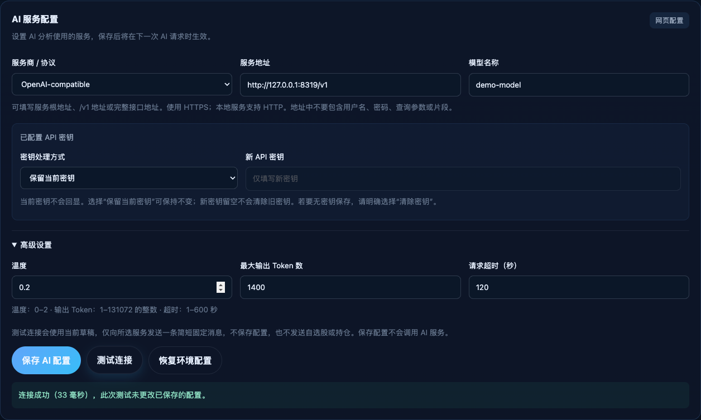

# Web AI Settings Verification

Date: 2026-09-13
Status: implementation, independent reviews, local acceptance and repository publication verified.

## Scope

Web editing of local AI settings, persistent request-time overrides, redacted
credential handling and fixed-message connection tests. The user approved the
[design](../superpowers/specs/2026-09-13-web-ai-settings-design.md) and
[implementation plan](../superpowers/plans/2026-09-13-web-ai-settings.md).

## Verification record

| Check | Result |
| --- | --- |
| Backend full regression | 382 passed |
| Frontend full regression | 163 passed across 14 files |
| Frontend production build | Passed, 59 modules |
| Launcher regression | 15 passed |
| Actual isolated watchlist smoke | Passed |
| Independent backend specification and quality reviews | Both passed; 129 focused tests, atomic-write failure and concurrent snapshot checks |
| Independent frontend specification and quality reviews | Both passed; each reviewer reran 63 focused tests |
| Actual HTTP and persistence acceptance | 19 checks passed |
| Actual browser acceptance | 18 checks passed |
| Responsive inspection | No document overflow at 320, 390, 768 and 1440px; desktop/mobile captures visually inspected |

Commands used for the complete automated checks:

```bash
PYTHONPATH=backend backend/.venv/bin/python -m pytest backend/tests -q
npm test --prefix frontend -- --run
npm run build --prefix frontend
PYTHONPATH=backend backend/.venv/bin/python -m pytest scripts/tests -q
./scripts/smoke_watchlist.sh
```

The HTTP checks covered redacted reads, mutation-token rejection, save without a
model call, test without persistence, credential reuse conflicts, controlled
provider failures, explicit clearing, reset, actual backend-process restart,
owner-only 0600 file permissions, frontend proxy access and an empty fallback key.

Browser checks covered model-only setup, draft testing, failed authentication,
replacement-key clearing after save, close/reopen and reload, advanced parameters,
protocol switching, OpenAI and Anthropic messages, Kimi alias retention, clear-key
and reset/cancel flows, Chinese/English feedback and draft preservation. No AI
configuration, key or mutation token appeared in browser local/session storage;
no JavaScript page errors occurred.

Review findings were fixed and reverified: legacy URL credential redaction,
empty fallback-key retention, and duplicate client/server URL equivalence checks.
The protected backend owns endpoint equivalence before any retained-key request.

## Actual runtime interface



This direct capture uses a demo model and a loopback mock service. Its success
message records a fixed-message local connection test, not real external model
availability. Screenshot provenance is in [images/README.md](../images/README.md).

## Isolation and claim limits

- Runtime acceptance used a separate database, AI settings file and local ports.
- The local mock model service accepted invented credentials and a fixed test
  message. No real user watchlist, holdings or analysis context was sent to it.
- Actual user configuration file hashes and all five watchlist rows matched the
  pre-test baseline; holdings remained empty. Temporary services were stopped and
  the user's existing application was retained.
- Fresh external stock/holding analysis remains a separate backend acceptance
  item requiring valid provider authentication, structured generation,
  persistence and history/cache replay.
- Private test logs and fixtures are excluded from version control.

## Repository delivery

README and the environment template now describe web-first setup, configuration
precedence, key handling and local-only operation. The existing homepage/detail
screenshots remain in the project introduction, with an additional settings
capture linked from its AI setup section.

- Feature commit: [`d1ee72c`](https://github.com/BirdieMoon-peter/Investment-Board/commit/d1ee72c038f7f804c2c6a2a5538ecca5bff6a036), pushed normally to `main`.
- Hosted [CI run 34749705234](https://github.com/BirdieMoon-peter/Investment-Board/actions/runs/34749705234): both **Backend and launchers** and **Frontend tests and build** passed on Ubuntu.
- The user's existing backend and frontend proxy both returned the new redacted settings API successfully after publication, without any configuration mutation.
- This delivery record is a documentation-only follow-up to the verified feature commit. The latest commit's CI status remains visible in the repository's [workflow runs](https://github.com/BirdieMoon-peter/Investment-Board/actions/workflows/ci.yml).
